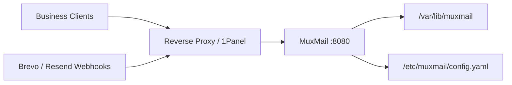

# MuxMail 部署指南

MuxMail 当前 MVP 推荐使用 Lite 模式部署：一个 MuxMail 进程，一个持久化数据目录，一个反向代理负责 HTTPS 终止。

运行命令固定为：

```text
muxmail serve -c /etc/muxmail/config.yaml
```

MuxMail 进程内不处理 TLS。公网 HTTPS 必须由 1Panel、OpenResty、Nginx、Caddy 或其他反向代理终止后，再把 HTTP 请求转发到 MuxMail 的 `8080` 端口。

## 1. 推荐部署拓扑



推荐原因：

- 符合当前 Lite 模式设计，不依赖 PostgreSQL 或 Redis。
- 业务发送 API 和 Provider Webhook 可以统一走 HTTPS 域名入口。
- 日志文件、退信名单和配置文件都能直接挂载到宿主机持久化。

## 2. 上线前准备

在开始部署前，先准备好下面这些内容：

1. 一个对外访问的 HTTPS 域名，用于暴露 MuxMail API 和可选的 Webhook 接收地址。
2. 已在邮件服务商控制台完成验证的发信域名或子域名，例如 `auth.example.com`、`auth-bak.example.com`。
3. 真实的业务 API Key、Brevo API Key、Resend API Key，以及可选的 Webhook Secret。
4. 一个可持久化的数据目录，用于保存 JSONL 日志和 `suppression.yaml`。
5. 一个生产配置文件，建议从 [config.container.example.yaml](D:/Coding/Go/MuxMail/config.container.example.yaml) 复制后修改。

生产环境不要在配置文件中使用 `plain:` 密钥引用。真实部署只使用：

- `env:NAME`
- `file:/run/secrets/name`

## 3. 宿主机目录建议

推荐在宿主机上整理成下面的目录结构：

```text
muxmail/
  compose.yaml
  config.yaml
  .env
  data/
    logs/
    suppression.yaml
```

其中：

- `config.yaml` 挂载到容器内的 `/etc/muxmail/config.yaml`
- `data/` 挂载到容器内的 `/var/lib/muxmail`
- `.env` 只保存在宿主机本地，不提交到仓库

容器以非 root 用户运行，所以宿主机挂载目录必须对容器用户可写，至少保证 `/var/lib/muxmail` 下的日志目录和 `suppression.yaml` 可写。

## 4. 配置文件要点

推荐从 [config.container.example.yaml](D:/Coding/Go/MuxMail/config.container.example.yaml) 开始。这个示例已经适配容器路径，并默认使用 `env:` 引用密钥。

部署时重点检查这些字段：

### 4.1 监听与代理

```yaml
server:
  listen: ":8080"
  trusted_proxies:
    - 172.16.0.0/12
    - 10.0.0.0/8
```

`trusted_proxies` 必须改成你自己反向代理所在的实际 IP 或 CIDR。不要配置 `0.0.0.0/0`，否则外部客户端可以伪造 `X-Forwarded-For`。

如果反向代理和 MuxMail 在同一台机器，常见写法是：

```yaml
server:
  listen: ":8080"
  trusted_proxies:
    - 127.0.0.1
    - ::1
```

### 4.2 日志与退信名单

```yaml
logging:
  dir: /var/lib/muxmail/logs
  max_file_size_mb: 100
  max_backups: 5

suppression_file: /var/lib/muxmail/suppression.yaml
```

要求：

- `logging.dir` 必须在持久化挂载目录下。
- `suppression_file` 建议也放在 `/var/lib/muxmail` 下。
- 如果启用了 Webhook 自动写入退信或投诉，`suppression_file` 必须可写。

### 4.3 密钥引用

生产部署配置示例：

```yaml
apps:
  - code: project_a
    api_keys:
      - name: default
        enabled: true
        key_ref: env:PROJECT_A_MUXMAIL_KEY

provider_accounts:
  - code: brevo_main
    provider: brevo
    enabled: true
    credentials:
      api_key: env:BREVO_API_KEY
```

如果你更喜欢 secrets 文件，也可以这样写：

```yaml
credentials:
  api_key: file:/run/secrets/brevo_api_key
```

### 4.4 Webhook

Webhook 默认关闭。只有需要接收投递结果时才开启：

```yaml
webhooks:
  enabled: true
  shared_secret_ref: env:MUXMAIL_WEBHOOK_SECRET
  resend_secret_ref: env:RESEND_WEBHOOK_SECRET
  brevo_token_ref: env:BREVO_WEBHOOK_TOKEN
```

对应的接收地址是：

- `POST /v1/provider-events`
- `POST /v1/provider-events/resend`
- `POST /v1/provider-events/brevo`

## 5. 本地运行流程

如果你现在还在联调阶段，推荐先走本地运行，把配置、模板、路由和 API 调通，再切到容器部署。

### 5.1 准备本地配置

推荐从 [config.example.yaml](D:/Coding/Go/MuxMail/config.example.yaml) 复制出一份本地配置，例如：

```text
config.local.yaml
```

本地运行时重点调整这几项：

1. 把 `logging.dir` 改成当前机器上可写的本地目录。
2. 把 `suppression_file` 改成当前机器上可写的本地文件路径。
3. 把 `plain:` 示例密钥替换成你自己的 `env:` 或 `file:` 引用；如果只是本地快速联调，也可以暂时保留示例值。
4. 根据你的反向代理或本机访问方式调整 `server.listen` 和 `server.trusted_proxies`。

如果你使用 `env:` 密钥引用，先在当前终端注入环境变量，例如：

```powershell
$env:PROJECT_A_MUXMAIL_KEY = "replace-with-your-app-key"
$env:BREVO_API_KEY = "replace-with-your-brevo-key"
$env:RESEND_API_KEY = "replace-with-your-resend-key"
```

一个适合本地联调的最小思路是：

```yaml
server:
  listen: "127.0.0.1:8080"

logging:
  dir: ./data/logs

suppression_file: ./data/suppression.yaml
```

### 5.2 准备本地目录

在运行前，确保本地日志目录和退信名单文件所在目录可写。

推荐准备：

```text
data/
  logs/
  suppression.yaml
```

如果 `suppression.yaml` 还不存在，可以先创建一个最小文件：

```yaml
entries: []
```

### 5.3 校验配置

先跑一遍配置校验：

```powershell
go run ./cmd/muxmail config validate -c config.local.yaml
```

如果这份配置要按生产习惯管理 secrets，再跑严格模式：

```powershell
go run ./cmd/muxmail config validate -c config.local.yaml --strict
```

如果你只是想快速验证仓库自带示例，也可以直接运行：

```powershell
go run ./cmd/muxmail config validate -c config.example.yaml
```

### 5.4 做一次 dry-run

本地联调前建议先做 dry-run：

```powershell
go run ./cmd/muxmail send dry-run -c config.local.yaml --app project_a --scene register_code --to user@example.com --locale en-US --var code=123456 --var expire_minutes=10
```

这一步不会真实发信，但能确认：

- App、Scene、Template 能正确匹配
- locale 能正确解析
- 模板变量齐全
- route policy 能选出候选通道

### 5.5 启动服务

直接启动本地服务：

```powershell
go run ./cmd/muxmail serve -c config.local.yaml
```

如果你已经先执行过构建，也可以直接运行二进制：

```powershell
go build -o ./bin/muxmail ./cmd/muxmail
.\bin\muxmail serve -c config.local.yaml
```

服务启动后，MuxMail 会同时启动 HTTP API 和内存 Worker。

### 5.6 最小本地联调

启动成功后，先检查健康接口：

```powershell
curl.exe http://127.0.0.1:8080/healthz
curl.exe http://127.0.0.1:8080/readyz
```

然后用本地配置里的业务 API Key 调一次发送接口：

```powershell
curl.exe -X POST http://127.0.0.1:8080/v1/mail/send `
  -H "Authorization: Bearer <app_api_key>" `
  -H "Content-Type: application/json" `
  -H "Idempotency-Key: local-test-001" `
  -d "{\"scene\":\"register_code\",\"to\":\"user@example.com\",\"locale\":\"en-US\",\"vars\":{\"code\":\"123456\",\"expire_minutes\":\"10\"}}"
```

成功后再查看本地日志目录，确认是否生成：

- `mail-messages.jsonl`
- `mail-attempts.jsonl`
- 可选的 `mail-stats.jsonl`

### 5.7 本地验证命令

如果你想先把整个仓库的默认校验流程跑一遍，当前推荐命令是：

```powershell
make verify
```

如果本机 `go` 默认缓存目录不可写，可以按 [README.md](D:/Coding/Go/MuxMail/README.md) 里的方式先设置：

```powershell
$env:GOCACHE = (Join-Path (Get-Location) '.gocache')
make verify
```

## 6. Docker Compose 部署

仓库里已经提供了 [compose.example.yaml](D:/Coding/Go/MuxMail/compose.example.yaml)。生产环境建议复制成自己的 `compose.yaml`，再替换镜像名、环境变量和值。

一个最小可用的 Compose 例子如下：

```yaml
services:
  muxmail:
    image: muxmail:local
    container_name: muxmail
    restart: unless-stopped
    ports:
      - "8080:8080"
    environment:
      PROJECT_A_MUXMAIL_KEY: "${PROJECT_A_MUXMAIL_KEY}"
      BREVO_API_KEY: "${BREVO_API_KEY}"
      RESEND_API_KEY: "${RESEND_API_KEY}"
    volumes:
      - ./config.yaml:/etc/muxmail/config.yaml:ro
      - ./data:/var/lib/muxmail
```

说明：

- 如果反向代理和 MuxMail 在同一台宿主机，端口可以只绑定到回环地址，例如 `127.0.0.1:8080:8080`。
- 如果使用独立 Docker 网络和反向代理容器，也可以不对宿主机暴露公网端口，只保留容器间访问。
- `config.yaml` 使用只读挂载。
- `data` 使用读写挂载。

如果你直接使用仓库根目录里的示例文件，默认命令是：

```text
docker compose -f compose.example.yaml up -d
```

## 7. 启动前检查

建议在真正启动服务前做三件事。

### 7.1 严格校验配置

如果你在源码目录部署，可以直接执行：

```text
go run ./cmd/muxmail config validate -c config.yaml --strict
```

如果你通过容器部署，可以在启动前执行同等校验：

```text
docker compose run --rm muxmail config validate -c /etc/muxmail/config.yaml --strict
```

`--strict` 会拒绝所有 `plain:` 密钥引用，这一步应该作为生产发布前的必做检查。

### 7.2 做一次 dry-run

```text
go run ./cmd/muxmail send dry-run -c config.yaml --app project_a --scene register_code --to user@example.com --locale en-US --var code=123456 --var expire_minutes=10
```

这一步不会真实发信，不会入队，也不会增加限流计数，但能提前发现：

- App 或 Scene 配错
- 模板缺变量
- 路由策略无法命中
- locale 配置不完整

### 7.3 确认目录权限

启动前至少确认下面两个路径可以被容器写入：

- `/var/lib/muxmail/logs`
- `/var/lib/muxmail/suppression.yaml`

如果目录不可写，`muxmail serve` 会在启动阶段失败。

## 8. 反向代理要求

反向代理至少需要满足这些要求：

1. 负责 HTTPS 证书和 TLS 终止。
2. 把请求转发到 `http://muxmail:8080` 或宿主机 `127.0.0.1:8080`。
3. 透传 `Host` 头。
4. 正确传递 `X-Forwarded-For` 和 `X-Real-IP`。
5. 不要拦截 `POST /v1/provider-events*` 这类 Webhook 路径。

建议把以下路径纳入健康检查或监控：

- `GET /healthz`
- `GET /readyz`

`/healthz` 表示进程存活，`/readyz` 表示配置、日志和队列已经就绪，可以对外提供服务。

## 9. 1Panel 部署

如果你使用 1Panel，推荐按下面的方式配置：

1. 创建一个 MuxMail 应用容器，镜像使用你自己构建或拉取的镜像。
2. 挂载配置文件到 `/etc/muxmail/config.yaml`。
3. 挂载持久化目录到 `/var/lib/muxmail`。
4. 通过环境变量注入 `PROJECT_A_MUXMAIL_KEY`、`BREVO_API_KEY`、`RESEND_API_KEY`，以及可选的 Webhook Secret。
5. 在 1Panel 的反向代理里把 HTTPS 域名转发到 MuxMail 容器的 `8080` 端口。
6. 把 `server.trusted_proxies` 配置成 1Panel/OpenResty 实际所在的地址或网段。

如果 1Panel 和 MuxMail 不在同一个容器网络，优先使用固定内网地址或固定网段，不要把整段公网地址加入 `trusted_proxies`。

## 10. Webhook 上线注意事项

只有在你确实需要 `delivered`、`bounced`、`complained` 这些状态时才启用 Webhook。

启用后需要同步检查：

1. `webhooks.enabled` 已设为 `true`。
2. 对应 Secret 已通过 `env:` 或 `file:` 正确注入。
3. 反向代理已放通 `POST /v1/provider-events*`。
4. Provider 控制台中的回调地址是公网 HTTPS 地址。
5. `suppression_file` 位于可写的持久化目录。

Resend 原生 Webhook 校验 `svix-id`、`svix-timestamp`、`svix-signature`。
Brevo 原生 Webhook 使用配置中的 Bearer Token。

## 11. Provider 侧建议

当前 MVP 不主动启用打开追踪和点击追踪。建议在 Brevo 和 Resend 后台也关闭默认的 open/click tracking，避免和事务邮件场景混在一起。

同时建议：

- 为主通道和备用通道使用不同的发信子域名。
- 验证码、找回密码等刚需邮件与普通通知分离域名。
- 不要用多个同类免费账号轮换额度。

## 12. 持久化与备份

Lite 模式下，真正需要持久化的是：

- `config.yaml`
- `suppression.yaml`
- `mail-messages.jsonl`
- `mail-attempts.jsonl`
- 可选的 `mail-events.jsonl`
- 可选的 `mail-stats.jsonl`

建议：

1. 把 `/var/lib/muxmail` 作为独立持久化卷或宿主机目录。
2. 把 `config.yaml` 纳入配置备份，但不要把真实 secrets 直接写进仓库。
3. 定期备份 `suppression.yaml` 和 JSONL 日志。

需要注意的是，Lite 模式的内存队列、内存限流和幂等缓存不会跨进程重启恢复，这属于当前 MVP 的设计边界。

## 13. 常见排障

### 13.1 服务启动失败

优先检查：

- `config validate -c ... --strict` 是否通过
- 环境变量是否真的存在
- `logging.dir` 和 `suppression_file` 是否可写
- `from` 域名是否与 `sender_domain` 一致

### 13.2 请求来源 IP 不正确

通常是 `server.trusted_proxies` 配错。MuxMail 只会在连接来源命中 `trusted_proxies` 时才信任 `X-Forwarded-For` 或 `X-Real-IP`。

### 13.3 dry-run 能通过，但真实发送失败

重点看：

- Provider API Key 是否正确
- 发信域名是否在 Provider 控制台完成验证
- SMTP 通道的 `host`、`port`、`username`、`password_ref` 是否正确
- 路由命中的首选通道是否被服务商拒绝

排查文件通常在：

- `/var/lib/muxmail/logs/mail-messages.jsonl`
- `/var/lib/muxmail/logs/mail-attempts.jsonl`

### 13.4 Webhook 没有生效

优先检查：

- `webhooks.enabled` 是否开启
- 回调地址是否是公网 HTTPS
- 反向代理是否转发了 `POST /v1/provider-events*`
- Secret 是否和 Provider 控制台配置一致

### 13.5 退信名单没有更新

通常有两类原因：

1. Webhook 事件里没有可用的收件人地址。
2. `suppression_file` 不可写，导致自动 upsert 失败。

## 14. 推荐上线顺序

为了降低第一次上线的风险，推荐按这个顺序推进：

1. 先只启用一个 App、一个 Scene 和一个主通道。
2. 用 `config validate --strict` 和 `send dry-run` 把配置打通。
3. 通过反向代理暴露 `POST /v1/mail/send`，先做内网联调。
4. 确认 `mail-messages.jsonl` 和 `mail-attempts.jsonl` 正常落盘。
5. 再增加备用通道。
6. 最后再启用 Provider Webhook。

这样可以先把发送链路跑通，再逐步打开事件回写和退信自动维护，排障会更轻松。
