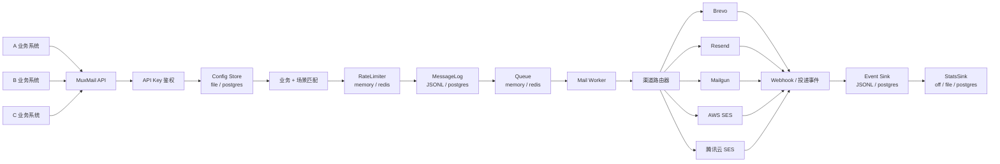
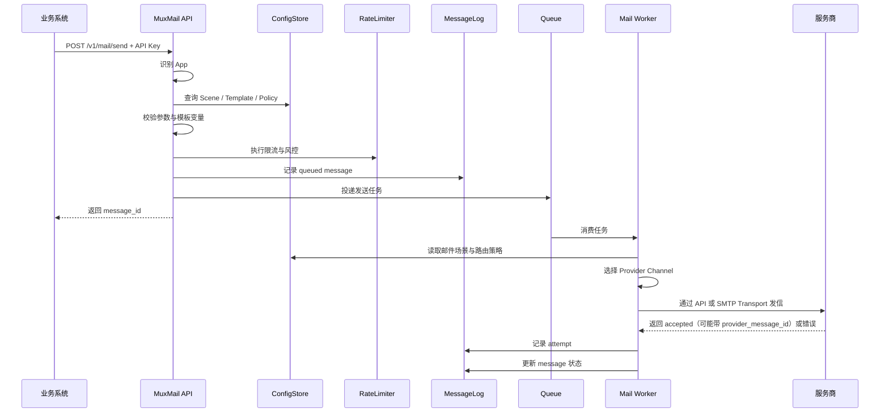
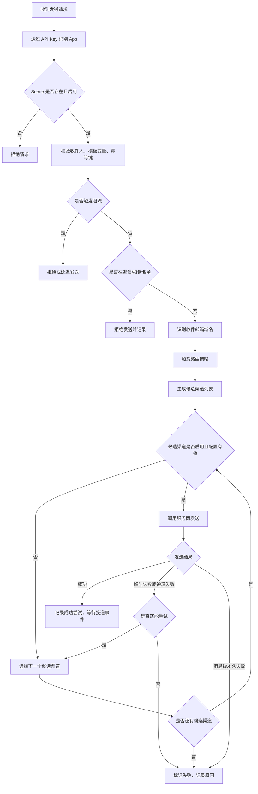
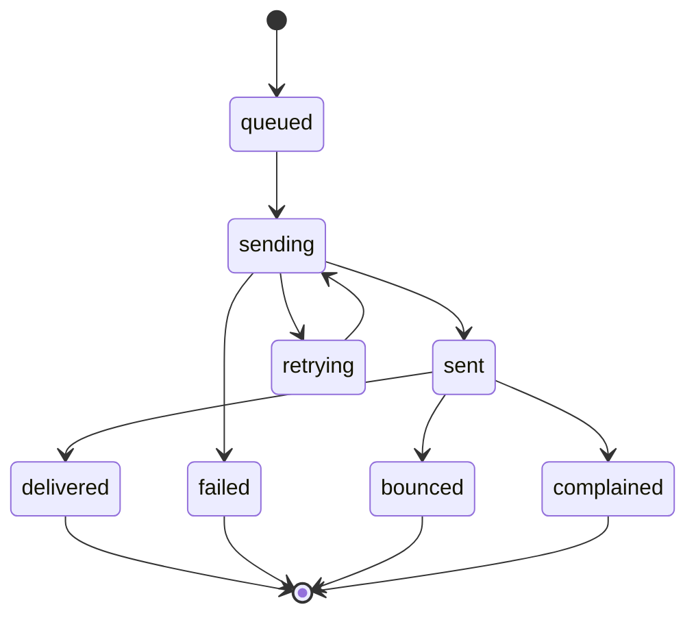

# MuxMail Design

## 1. 目标

MuxMail 是一个开源、自托管的多业务、多场景、多服务商统一发信网关，默认部署体验面向个人和小团队自用。

业务系统只接入 MuxMail 的统一 API，不直接对接 Brevo、Resend、Mailgun、AWS SES、腾讯云 SES 等具体服务商。MuxMail 负责业务识别、场景匹配、模板渲染、限流风控、渠道选择、队列发送、失败重试、备用切换、日志记录和投递事件处理。

核心目标：

- 多业务统一接入，每个业务分配独立 API Key。
- 多场景配置，例如注册验证码、找回密码、系统通知、订单通知。
- 多服务商账号管理，不把服务商细节暴露给业务系统。
- 按业务、场景、收件邮箱域名和路由策略选择渠道，后续再引入额度、健康度和成本因子。
- 避免单一服务商额度、风控或故障导致刚需邮件不可用。

## 2. 核心概念

```text
App / 业务应用
  -> API Key / 接入密钥
  -> Scene / 发信场景
    -> Template / 邮件模板
    -> Route Policy / 路由策略
    -> Rate Limit Policy / 限流策略
    -> Provider Channel / 发信通道
      -> Provider Account / 服务商账号
      -> Sender Domain / 发信域名
```

MuxMail 直接以 `App` 作为最高级业务隔离单元。

### App

一个接入 MuxMail 的业务系统，例如：

- A 业务
- B 业务
- C 业务

每个 App 支持多个 API Key，便于密钥轮换和灰度迁移。

### Scene

发信场景决定邮件用途和策略，例如：

- `register_code`: 注册验证码
- `reset_password`: 找回密码
- `login_notice`: 登录提醒
- `order_notice`: 订单通知
- `system_alert`: 系统告警

不同场景绑定模板、限流规则和路由策略。发信域名不直接挂在 Scene 上，而是由候选 Provider Channel 决定。

### Provider Account

服务商账号保存服务商类型和凭据，例如：

- Brevo 账号
- Resend 账号
- Mailgun 账号
- AWS SES 账号
- 腾讯云 SES 账号
- 阿里云 DirectMail 账号

服务商账号应归属于 MuxMail 统一管理，业务系统不需要知道账号密钥。

### Provider Channel

Provider Channel 是实际参与路由的发信通道。它由 Provider Account、Transport 和 Sender Domain 组成。

```text
Provider Account: resend_main
Transport: api 或 smtp
Sender Domain: auth.example.com
From: no-reply@auth.example.com
```

同一个 Provider Account 可以配置多个 Channel，例如：

```text
resend_auth_api   -> Resend Account + API  transport + auth.example.com
resend_auth_smtp  -> Resend Account + SMTP transport + auth-smtp.example.com
```

路由策略绑定 Provider Channel，不直接绑定 Provider Account。这样同一个服务商账号下的 API 和 SMTP 可以独立配置、独立限流、独立统计和独立熔断。

### Sender Domain

发信域名用于隔离信誉和认证记录，例如：

```text
auth.example.com
auth-bak.example.com
notify.example.com
notify-bak.example.com
marketing.example.com
```

验证码、找回密码等刚需邮件建议独立使用 `auth.example.com`，避免被营销或低质量通知污染信誉。

不同 Provider 建议优先使用不同发信子域名。这样 Brevo、Resend、Mailgun、AWS SES 等服务商的 SPF、DKIM、DMARC、Return-Path、Bounce、Tracking 记录互不冲突，也方便单独观察每个通道的信誉和风险。

推荐命名方式按用途和主备关系划分，不直接暴露服务商名称：

```text
auth.example.com        -> 验证码/找回密码主通道
auth-bak.example.com    -> 验证码/找回密码备用通道
notify.example.com      -> 系统通知主通道
notify-bak.example.com  -> 系统通知备用通道
marketing.example.com   -> 营销或活动邮件
```

示例：

```text
no-reply@auth.example.com      -> Brevo 主通道
no-reply@auth-bak.example.com  -> Resend 备用通道
notice@notify.example.com      -> 系统通知主通道
notice@notify-bak.example.com  -> 系统通知备用通道
```

注意：`@` 前面的 `no-reply`、`notice`、`contact` 只是本地邮箱名，真正影响 DNS 认证和发信信誉的是 `@` 后面的域名。

MuxMail 第一版采用隔离域名模式：

```text
一个 Provider Channel 绑定一个 Sender Domain。
一个 Scene 支持配置多个 Provider Channel 作为候选通道。
主通道和备用通道允许使用不同 From 域名。
```

第一阶段资源归属固定为：

```text
App 拥有 API Key、Scene、Template。
Scene 内联配置 Route Policy 和 Rate Limit Policy。
Provider Account、Provider Channel、Sender Domain 是 MuxMail 全局资源。
Scene 的 route_policy 通过 Provider Channel code 引用全局发信通道。
Template 查找必须限定在当前 App 内，Scene 不能引用其他 App 的 Template。
Suppression List 按 App + normalized_to_email 隔离。
```

## 3. 推荐架构



## 4. 开源运行模式

MuxMail 面向开源部署时应保持轻量，默认一个 Docker 容器即可运行。PostgreSQL、Redis、统计与管理后台都应作为可选增强能力，而不是启动门槛。

推荐支持三种运行模式：

### Lite 模式

适合个人、自用、小业务、快速试用。

```text
MuxMail 单容器
  -> 配置文件存储 App / Scene / Provider / Route Policy
  -> 进程内队列
  -> 进程内限流
  -> 发送记录写入日志文件
  -> 可选开启简易统计文件
```

特点：

- 不依赖 PostgreSQL。
- 不依赖 Redis。
- 配置通过 `config.yaml` 或环境变量提供。
- 容器重启后进程内队列和内存限流状态会丢失。
- 适合低并发和非严格审计场景。

Lite 模式的可靠性边界：

```text
已返回 queued 但尚未发送的内存任务，在进程退出时可能丢失。
JSONL 日志只提供追加记录，不提供复杂查询、去重修复或事务一致性。
内存限流只对当前进程生效，多实例部署必须切换到 Redis 限流。
配置文件修改后需要重载或重启，第一版不要求支持后台热更新。
```

Lite 模式内存队列规则：

```text
队列容量：1000
Worker 并发：4
队列满时发送接口返回 503 queue_full
重试 backoff：第 1 次立即发送，第 2 次等待 30 秒，第 3 次等待 120 秒
队列容量统计包含等待发送的 queued message 和等待 backoff 的 retrying message。
Worker 正在执行的 in-flight message 不计入队列容量。
```

Lite 模式幂等缓存规则：

```text
缓存容量：10000 条。
TTL：24 小时。
缓存 key：App + Scene + idempotency_hash。
缓存 value：message_id、request_fingerprint、status、created_at。
超过容量时按最早 created_at 淘汰。
TTL 过期后，相同 Idempotency-Key 视为新请求。
进程重启后幂等缓存丢失，这是 Lite 模式可靠性边界的一部分。
```

Lite 模式 Worker 调度规则：

```text
attempt_no 从 1 开始递增，最大值等于 max_attempts_per_message。
每个 attempt_no 最多调用一个 Provider Channel。
第 1 次 attempt 使用 retry_backoff_seconds[0]，固定为 0。
第 N 次 attempt 开始前等待 retry_backoff_seconds[N-1]。
temporary_failure 或 channel_failure 后，下一次 attempt 选择下一个候选 Provider Channel。
第一阶段不对同一个 Provider Channel 做二次重试。
message_permanent_failure 立即结束消息，不等待 backoff。
Provider 返回 retry_after_seconds 时，实际等待时间取 max(retry_backoff_seconds[N-1], retry_after_seconds)，但第一阶段最大等待 300 秒。
进程退出时尚未开始的延迟 attempt 会丢失，这是 Lite 模式可靠性边界的一部分。
```

### Standard 模式

适合正式自用部署。

```text
MuxMail API + Worker
  -> 配置文件或 PostgreSQL 存储配置
  -> Redis 队列
  -> Redis 限流
  -> 日志文件或 PostgreSQL 记录发送结果
```

特点：

- Redis 必须开启，用于可靠队列和跨进程限流。
- PostgreSQL 可选，开启后可以持久化配置、发送记录和统计数据。
- 可以支持更可靠的重试、延迟任务和限流。

### Full 模式

适合多业务、较高并发、需要审计和统计的部署。

```text
MuxMail API
MuxMail Worker
PostgreSQL
Redis
Admin UI
Webhook Receiver
Metrics / Alerting
```

特点：

- PostgreSQL 作为主存储。
- Redis 作为队列、限流和缓存。
- 支持完整发送日志、Webhook 事件、退信名单、渠道健康度、费用统计和后台管理。

## 5. 可选组件策略

MuxMail 的组件应尽量可插拔：

```text
Config Store:
  file        默认，读取 config.yaml
  postgres    可选，支持后台动态配置

Queue:
  memory      默认，单进程内队列
  redis       可选，支持可靠重试和多 Worker

Rate Limit:
  memory      默认，单实例限流
  redis       可选，支持多实例共享限流

Send Log:
  file        默认，JSONL 日志文件
  postgres    可选，结构化查询和后台展示

Stats:
  off         默认关闭
  file        开启后写入统计日志
  postgres    开启后写入统计表

Suppression List:
  file        默认，读取 suppression.yaml
  postgres    可选，支持 Webhook 自动写入和后台管理
```

第一阶段 Suppression 规则固定为静态文件模式：

```text
默认文件路径：data/suppression.yaml
可通过 suppression_file 配置覆盖
匹配维度：app + normalized_to_email
文件不存在时视为空名单
命中后拒绝入队，返回 suppressed_recipient
启用 Webhook Receiver 后，bounce / complaint 事件可自动写入
不支持后台管理
```

Suppression 文件规则：

```text
文件格式第一阶段固定为 YAML。
文件路径相对于 config.yaml 所在目录解析。
文件不存在时视为空名单。
文件存在但解析失败时，muxmail serve 和 config validate 都失败。
每个条目必须包含非空 app、合法的单个 ASCII addr-spec email、合法 reason。
Webhook 自动写入时按 app 和 normalized_to_email 去重，complaint 可升级 hard_bounce，不覆盖 manual。
email 按 normalized_to_email 规则归一化后匹配。
reason 允许值固定为 hard_bounce、complaint、manual。
```

第一阶段配置中的 `enabled` 语义固定为：

```text
App、API Key、Scene、Template、Provider Account、Provider Channel 都支持 enabled 字段。
enabled 缺省时视为 true。
显式设置 enabled: false 时，该对象不可参与鉴权、路由、渲染或发送。
```

第一阶段配置标识符规则固定为：

```text
适用字段：App code、API Key name、Scene code、Template code、Provider Account code、Provider Channel code。
长度：1 到 64 个字符。
允许字符：小写字母 a-z、数字 0-9、下划线 "_"、短横线 "-"。
必须以小写字母或数字开头和结尾。
配置加载时不自动大小写转换，违反规则直接 config validate 失败。
```

API Key 规则：

```text
请求格式固定为 Authorization: Bearer {api_key}。
第一阶段 API Key 明文建议前缀为 mk_live_ 或 mk_test_。
API Key 最小长度 24 bytes，最大长度 128 bytes，只允许可见 ASCII 字符，不允许空白字符、控制字符和非 ASCII 字符。
解析后的 API Key 明文值必须在所有 App 中全局唯一，避免同一个 Bearer token 被多个 App 或被停用 key 抢先匹配。
API Key 格式非法、未匹配或 key 已禁用时只返回 unauthorized，不暴露 key 是否存在、是否禁用或属于哪个 App。
API Key 已匹配但 App 已停用时返回 app_disabled，不返回 App code、App name 或 API Key 元数据。
JSONL 日志只记录 api_key_name，不记录 API Key 明文、哈希或前缀。
Lite 模式加载 key_ref 后，内存中只保留 key_hash，不保留 API Key 明文。
第一阶段 key_hash 使用 SHA-256(api_key) 的小写 hex。
鉴权比较必须使用 constant-time compare。
PostgreSQL 模式保存相同格式的 key_hash，不保存 API Key 明文。
```

内部 ID 规则：

```text
request_id 使用 req_ 前缀。
message_id 使用 msg_ 前缀。
ID 主体使用 ULID 风格的 26 位大写 Crockford Base32 字符串。
ID 必须由 MuxMail 生成，客户端传入的 context.request_id 只能进入 business_request_id。
```

如果开启统计但未配置 PostgreSQL，则统计数据写入日志文件，例如：

```text
data/logs/mail-messages.jsonl
data/logs/mail-attempts.jsonl
data/logs/mail-stats.jsonl
```

`mail-events.jsonl` 属于 Webhook 能力。`webhooks.enabled: false` 时不创建；启用 Webhook Receiver 后创建。

第一阶段 JSONL 日志字段固定为：

```text
mail-messages.jsonl:
  ts, request_id, business_request_id, message_id, app, api_key_name, scene, to_domain, to_hash, locale, status, idempotency_hash, request_fingerprint, caller_ip, user_ip, user_id_hash, error_code, error_message

mail-attempts.jsonl:
  ts, message_id, app, attempt_no, provider, provider_account, provider_channel, transport, status, failure_class, error_code, error_message, provider_message_id, duration_ms

mail-stats.jsonl:
  ts, app, scene, provider_channel, transport, metric, value

mail-events.jsonl:
  ts, message_id, app, provider, provider_account, provider_channel, provider_message_id, event_type, event_payload, occurred_at
```

第一阶段 Webhook Receiver 不把原始 Provider Webhook Payload 或标准化请求中的原始 `event_payload` 写入 `mail-events.jsonl`。`event_payload` 只保存脱敏后的来源摘要，例如 `{"source":"resend"}`、`{"source":"brevo"}` 或 `{"source":"generic"}`。

时间字段规则：

```text
所有 JSONL 的 ts 使用 UTC RFC3339Nano 字符串，例如 2026-05-28T03:04:05.123456789Z。
所有数据库时间字段使用 timestamptz，写入 UTC。
API 响应第一阶段不返回服务端时间字段。
duration_ms 使用整数毫秒，四舍五入到最近毫秒，最小值为 0。
所有限流窗口按 UTC 计算。
```

JSONL 字段类型规则：

```text
ts、request_id、business_request_id、message_id、app、api_key_name、scene、to_domain、to_hash、locale、status、idempotency_hash、request_fingerprint、caller_ip、user_ip、user_id_hash、provider、provider_account、provider_channel、transport、failure_class、error_code、error_message、provider_message_id、metric 都是 string。
attempt_no、duration_ms 是 integer。
value 是 number。
缺失或不适用的 string 字段写空字符串，不写 null。
缺失或不适用的 number 字段写 0。
JSONL 字段顺序按文档列出的顺序输出。
```

字段枚举规则：

```text
message status: queued、sending、retrying、sent、failed、delivered、bounced、complained。
attempt status: sending、sent、failed。
failure_class: temporary_failure、channel_failure、message_permanent_failure，成功或不适用时为空字符串。
transport: api、smtp。
provider 第一阶段允许值：mock、resend、brevo。
```

第一阶段已接入平台、Transport、每日额度、月度额度和公开价格来源统一维护在 [provider-support.md](provider-support.md)。该矩阵只记录当前代码已接入平台，不把后续设计候选平台标记为已支持。

日志禁止记录完整 API Key、Provider Secret、验证码、重置 token、完整模板变量和完整收件人邮箱地址。

`to_hash` 规则固定为：

```text
to_hash = sha256(app + ":" + normalized_to_email) 的小写 hex。
to_hash 只用于日志排查和粗粒度关联，不作为安全匿名化承诺。
```

`user_id_hash` 规则固定为：

```text
context.user_id 为空时 user_id_hash 为空。
context.user_id 非空时，user_id_hash = sha256(app + ":" + context.user_id) 的小写 hex。
```

`idempotency_hash` 规则固定为：

```text
idempotency_hash = sha256(app + ":" + scene + ":" + Idempotency-Key) 的小写 hex。
JSONL 和数据库不保存 Idempotency-Key 明文。
```

`request_fingerprint` 规则固定为：

```text
request_fingerprint = sha256(canonical_request_json) 的小写 hex。
canonical_request_json 字段固定为 to、locale、vars。
to 使用 normalized_to_email。
locale 使用最终解析后的 locale。
vars 按字段名升序排序，保留 JSON number、boolean、string 的语义值。
request_fingerprint 只用于幂等冲突判断和审计排查，不反向保存 vars 明文。
```

JSONL 文件写入规则：

```text
logging.dir 启动时不存在则自动创建。
新建 logging.dir 权限使用 0750。
logging.dir 无法创建或不可写时，muxmail serve 启动失败。
新建 JSONL 文件权限使用 0640。
每条 JSONL 记录必须是单行 JSON。
每次追加后执行 flush，不要求每条记录 fsync。
进程崩溃时允许丢失操作系统尚未落盘的最后少量记录。
Stats 为 off 时不创建 mail-stats.jsonl。
第一阶段启用按文件大小轮转，不按日期轮转。
单个 JSONL 文件默认最大 100 MB。
每个 JSONL 文件默认保留 5 个历史备份。
轮转文件命名为 {filename}.1、{filename}.2，超过 max_backups 后删除最旧文件。
第一阶段不压缩历史日志。
```

Stats 文件规则：

```text
stats: off 时不采集统计，不创建 mail-stats.jsonl。
stats: file 时以 JSONL 事件流追加统计记录，不做窗口聚合。
stats: file 依赖 logging.dir，目录不可写时 muxmail serve 启动失败。
metric 固定为 messages_queued、messages_sent、messages_failed、attempts_sent、attempts_failed、requests_rate_limited、requests_queue_full、requests_idempotent_replay、provider_duration_ms。
value 固定为 number；计数类 metric value 为 1，duration metric value 为毫秒。
请求级 metric 的 provider_channel 和 transport 为空字符串。
Provider attempt 级 metric 必须填写 provider_channel 和 transport。
Lite Admin 统计摘要查询遇到无法解析的单行 stats 记录时跳过该行，避免单条损坏统计日志导致整个面板不可用；mail-messages、mail-attempts 和 mail-events 仍按审计状态源处理，解析失败应返回错误。
```

发送尝试落盘规则：

```text
每次调用 Provider Channel 前，mail-messages.jsonl 追加 sending 状态。
每次调用 Provider Channel 前，mail-attempts.jsonl 追加 sending attempt。
Provider 返回或超时后，mail-attempts.jsonl 追加同一 attempt_no 的 sent 或 failed 记录。
temporary_failure 或 channel_failure 且仍有剩余 attempt 时，mail-messages.jsonl 追加 retrying 状态。
消息最终失败时，mail-messages.jsonl 追加 failed 状态记录，包含最终 error_code。
消息成功被服务商接受时，mail-messages.jsonl 追加 sent 状态记录。
queued message 入队前写入失败时，请求返回 internal_error。
Worker 阶段 attempt 或最终 message 状态写入失败时，继续完成当前发送流程，同时输出结构化错误日志。
```

JSONL 状态恢复规则：

```text
同一个 message_id 的最新 mail-messages.jsonl 记录代表当前消息状态。
同一个 app + message_id + attempt_no 的最新 mail-attempts.jsonl 记录代表当前尝试状态。
Lite 模式启动时不扫描 JSONL 恢复未完成任务。
PostgreSQL 模式以后通过状态表恢复 queued / retrying 任务。
```

第一阶段不实现动态渠道健康度和额度学习。Provider Channel 是否可用只由配置 `enabled`、基础配置校验和本次发送返回结果决定；失败不会自动熔断，只会在当前消息内切换下一个候选 Channel。

这样可以保证：

- 单 Docker 容器可直接运行。
- 生产用户可以逐步打开 Redis 和 PostgreSQL。
- 开源用户不需要一开始就理解完整分布式架构。
- Lite Admin 在文件模式下提供只读和基础操作能力，完整动态配置管理仍放在 PostgreSQL 模式。

## 6. 推荐技术栈

后端：

```text
Go
net/http + chi
YAML 配置
html/template + text/template
JSONL 日志
可选 PostgreSQL + pgx + sqlc + goose
可选 Redis + Asynq
```

前端管理后台：

```text
React
Vite
TypeScript
Ant Design
TanStack Query
Recharts
```

部署：

```text
单容器模式：muxmail
标准模式：muxmail + redis
完整模式：muxmail-api + muxmail-worker + postgres + redis + admin
```

当前 Lite Admin 作为静态前端内置在单容器 `muxmail` 中，由同一个 HTTP 端口服务 `/admin/`。后台通过浏览器输入的 App API Key 调用现有 App-scoped API，只提供仪表盘、消息排查、Provider Event 查询、退信名单查询、测试发送和安全配置摘要，不在线编辑 YAML 配置、不显示 API Key、Provider Secret、Webhook Secret、SMTP 密码或运行时文件系统路径。

第一阶段进程模型固定为：

```text
muxmail serve -c config.yaml
```

`muxmail serve` 在同一进程内同时启动 HTTP API、内存队列消费者和后台 Worker。第一阶段不拆分 `api` / `worker` 两个独立进程。

第一阶段配置加载规则：

```text
-c / --config 必填。
不支持默认搜索当前目录 config.yaml。
配置文件路径可以是相对路径或绝对路径。
配置中的相对文件路径统一相对于 config.yaml 所在目录解析。
logging.dir、suppression_file、file: 密钥引用都遵循该规则。
环境变量引用 env:NAME 从进程环境读取。
配置文件读取失败、环境变量缺失或 file: 文件不可读时，启动和 config validate 都失败。
```

第一阶段 HTTP 运行时规则：

```text
默认监听地址：:8080。
server.listen 为空时使用 :8080。
第一阶段只提供 HTTP 明文服务，TLS 由反向代理或面板负责终止。
HTTP read timeout：10 秒。
HTTP read header timeout：5 秒。
HTTP write timeout：15 秒。
HTTP idle timeout：60 秒。
请求体读取必须受 max_request_body_bytes 限制。
CORS 默认关闭，不返回 Access-Control-Allow-Origin。
OPTIONS 请求默认返回 404。
```

第一阶段内置端点：

```text
GET /healthz
  返回 200，表示进程存活。

GET /readyz
  配置加载成功、日志目录可写、内存队列已初始化时返回 200，否则返回 503。

GET /version
  返回当前 MuxMail 构建版本。

POST /v1/mail/send
  业务发信接口。

GET /v1/mail/messages?limit=50&status=failed&scene=register_code
  查询当前 App 下最近消息的最新状态快照列表。

GET /v1/mail/messages/failed?limit=50&scene=register_code
  查询当前 App 下最近失败消息的快捷列表。

GET /v1/mail/messages/{message_id}
  查询当前 App 下某封邮件的最新状态。

GET /v1/mail/messages/{message_id}/events
  查询当前 App 下某封邮件的 Provider Event 时间线。

GET /v1/mail/messages/{message_id}/attempts
  查询当前 App 下某封邮件的 Provider Attempt 时间线。

GET /v1/suppressions?limit=50&reason=complaint&email=user@example.com
  查询当前 App 下的 suppression 列表。

GET /v1/provider-events?limit=50&provider=brevo&event_type=bounced
  查询当前 App 下最近的 Provider Event 列表。

GET /v1/stats/summary?window=24h
  查询当前 App 下的 Lite 模式统计汇总。

POST /v1/provider-events
  接收 MuxMail 标准化 Provider Event，推进 delivered、bounced、complained 状态。

POST /v1/provider-events/resend
  接收 Resend 原生 Webhook，校验 Svix 签名后映射为 MuxMail 标准 Provider Event。

POST /v1/provider-events/brevo
  接收 Brevo 原生 Webhook，校验 Bearer token 后映射为 MuxMail 标准 Provider Event。
```

`/healthz`、`/readyz` 和 `/version` 不需要 API Key，不输出配置、路径、密钥、Provider 状态或内部错误详情。`/version` 只返回 `VERSION` 文件嵌入进二进制的 SemVer 版本号。

所有 `/v1/` API 响应第一阶段固定设置 `Cache-Control: no-store`、`Pragma: no-cache` 和 `Expires: 0`，避免浏览器或反向代理缓存 App-scoped 配置摘要、消息状态、退信名单或事件数据。`/admin/` HTML 入口同样使用 `no-store`，避免单容器升级后浏览器继续使用旧前端入口文件；构建产物中的静态 asset 仍按普通静态文件服务。

`GET /v1/mail/messages/{message_id}` 需要 App API Key，只能查询该 App 自己的消息。Lite 模式从 `mail-messages.jsonl` 和轮转备份中线性扫描同一 `app + message_id` 的最新状态记录。接口不返回完整收件人邮箱、邮件正文、模板变量、caller_ip、user_ip、API Key 哈希、幂等哈希或请求指纹。

`GET /v1/mail/messages` 需要 App API Key，只能查询该 App 自己的消息列表。Lite 模式从 `mail-messages.jsonl` 和轮转备份中线性扫描每个 `app + message_id` 的最新状态记录，再按 `updated_at` 倒序返回。默认 `limit=50`，最大 `200`；`status` 和 `scene` 可选过滤，`scene` 必须符合 Scene code 标识符规则。接口返回与单条消息状态接口一致的安全字段集合，不返回完整收件人邮箱、正文、模板变量、caller_ip、user_ip、API Key 哈希、幂等哈希或请求指纹。

`GET /v1/mail/messages/failed` 是固定 `status=failed` 的快捷入口，适合值班排障或后台失败消息列表。默认 `limit=50`，最大 `200`；`scene` 可选过滤，且必须符合 Scene code 标识符规则。其返回字段与 `GET /v1/mail/messages` 相同。

`GET /v1/mail/messages/{message_id}/events` 需要 App API Key，只能查询该 App 自己的消息。Lite 模式从 `mail-events.jsonl` 和轮转备份中按时间顺序扫描同一 `app + message_id` 的事件记录。接口返回 `logged_at`、`provider`、`provider_account`、`provider_channel`、`provider_message_id`、`event_type`、`occurred_at`，不返回完整收件人邮箱，也不返回原始 Provider Webhook payload。

`GET /v1/mail/messages/{message_id}/attempts` 需要 App API Key，只能查询该 App 自己的消息。Lite 模式从 `mail-attempts.jsonl` 和轮转备份中按时间顺序扫描同一 `app + message_id` 的 attempt 记录。接口返回 `logged_at`、`attempt_no`、`provider`、`provider_account`、`provider_channel`、`transport`、`status`、`failure_class`、`error_code`、`provider_message_id`、`duration_ms`，不返回收件人邮箱、正文或模板变量。运行期无法解析 `provider_channel` 时，该次 `channel_failure` attempt 仍返回，`provider`、`provider_account` 和 `transport` 可为空字符串。

`GET /v1/suppressions` 需要 App API Key，只能查询该 App 自己的 suppression。默认 `limit=50`，最大 `200`；`reason` 和 `email` 可选过滤。该接口按用途返回 `email`、`normalized_email`、`reason`。这里允许返回完整邮箱，因为 suppression 管理、误封排查和人工清理本身就需要真实地址；这条规则只适用于受限的 App 自有查询接口，不改变 JSONL 日志和其他消息查询接口的脱敏要求。

`GET /v1/provider-events` 需要 App API Key，只能查询该 App 自己的最近 Provider Event。默认 `limit=50`，最大 `200`；`provider` 和 `event_type` 可选过滤。Lite 模式从 `mail-events.jsonl` 和轮转备份中按 `logged_at` 倒序扫描。接口返回 `message_id`、`logged_at`、`provider`、`provider_account`、`provider_channel`、`provider_message_id`、`event_type`、`occurred_at`，不返回原始 Provider Webhook payload，也不返回收件人邮箱。

`GET /v1/stats/summary` 需要 App API Key，只能聚合该 App 自己的统计。`window` 只允许 `1h`、`24h`、`7d`，默认 `24h`。`stats: off` 时返回空汇总；`stats: file` 时从 `mail-stats.jsonl` 和轮转备份中线性扫描并聚合 metric 总和，同时对 `provider_duration_ms` 按 provider_channel 输出 count、total_ms 和 average_ms。

`POST /v1/provider-events` 默认关闭。启用时必须配置 `webhooks.enabled: true` 和 `webhooks.shared_secret_ref`，请求使用 `Authorization: Bearer <webhook_shared_secret>`。该接口接收 MuxMail 标准事件。`bounced` 和 `complained` 事件必须带合法的单个 addr-spec `recipient_email`，这样 MuxMail 才能自动更新 `suppression.yaml`。完整收件人邮箱只用于 suppression 更新，不写入 JSONL 日志。

Webhook 写入 suppression 时按 App + normalized email upsert；`complaint` 可把已有 `hard_bounce` 升级为 `complaint`，但不得覆盖人工维护的 `manual` 条目，也不得把 `complaint` 降级回 `hard_bounce`。

所有 Webhook 事件必须带完整 `provider_account`、`provider_channel` 和 `provider_message_id`。正常情况下，事件中的 `app + message_id + provider + provider_account + provider_channel + provider_message_id` 必须匹配同一 App、同一消息下已记录的 `sent` attempt。如果服务商 accepted 响应没有返回 provider id，`sent` attempt 允许记录空 `provider_message_id`；这种情况下认证后的 Webhook 事件仍必须提供 `provider_message_id`，并且 `app + message_id + provider + provider_account + provider_channel` 必须匹配该 `sent` attempt。匹配失败时返回 `invalid_json`，不得追加 `mail-events.jsonl`、不得推进消息状态、不得修改 suppression。

Webhook 事件去重规则固定为：`app + message_id + provider + provider_account + provider_channel + provider_message_id + event_type + occurred_at`。同一 identity 的重复事件不重复追加 `mail-events.jsonl`；为了修复第一次处理时在追加事件后失败的场景，重复事件仍可重放幂等 suppression 更新，并按单调规则补写缺失的消息状态。

Webhook 状态推进规则固定为单调追加：`sent` 可推进到 `delivered`、`bounced` 或 `complained`；`delivered` 可被后续 `bounced` 或 `complained` 覆盖；`bounced` 只可进一步推进到 `complained`；`failed` 和 `complained` 不再被 Webhook 覆盖；迟到的 `delivered` 不得把 `bounced` 或 `complained` 回滚为 `delivered`。不参与状态推进的非重复事件仍追加到 `mail-events.jsonl`，bounce / complaint 仍按规则更新 suppression。

`POST /v1/provider-events/resend` 使用 Resend 官方 Svix 签名头：`svix-id`、`svix-timestamp`、`svix-signature`。启用时必须配置 `webhooks.enabled: true` 和 `webhooks.resend_secret_ref`，签名时间窗口固定为 5 分钟。MuxMail 发送 Resend API 邮件时写入 tags：`app`、`message_id`、`provider_account`、`provider_channel`，Resend webhook 必须携带这些 tags 才能关联并推进消息状态。第一版只映射 `email.delivered`、`email.bounced`、`email.complained`。对 bounce / complaint 事件，还要求 webhook payload 提供合法的单个 addr-spec 收件人邮箱，用于自动写入 suppression。

`POST /v1/provider-events/brevo` 启用时必须配置 `webhooks.enabled: true` 和 `webhooks.brevo_token_ref`，请求使用 `Authorization: Bearer <brevo_webhook_token>`。MuxMail 发送 Brevo API 邮件时写入 tags：`app:...`、`message_id:...`、`provider_account:...`、`provider_channel:...`。Brevo webhook 通过这些 tags 关联消息，并必须提供 `ts_event`，MuxMail 将其转换为 UTC RFC3339 `occurred_at`；不使用 Brevo `date` 字段作为审计时间，因为该字段不携带时区。第一版映射 `delivered -> delivered`、`hardBounce -> bounced`、`spam -> complained`，并兼容 `hard_bounce`、`invalid_email` 的 bounce 映射。对 bounce / complaint 事件，还要求 webhook payload 提供合法的单个 addr-spec 收件人邮箱，用于自动写入 suppression。

健康检查响应体固定为：

```json
{"status":"ok"}
```

`/readyz` 未就绪时返回：

```json
{"status":"not_ready"}
```

优雅停机规则：

```text
收到 SIGINT 或 SIGTERM 后，立即停止接受新的 HTTP 请求。
正在处理的 HTTP 请求最多等待 10 秒。
已经开始的 Provider 调用最多等待 provider_timeout_seconds。
尚未开始的内存队列任务和延迟 attempt 直接丢弃。
退出前 flush 已打开的 JSONL writer。
```

第二阶段引入 Redis 后再支持：

```text
muxmail api -c config.yaml
muxmail worker -c config.yaml
```

后端应通过接口隔离存储、队列、限流和统计实现，避免业务逻辑绑定到某一种基础设施。

建议抽象：

```text
ConfigStore
Queue
RateLimiter
MessageLog
StatsSink
SuppressionStore
Provider
Transport
```

模板规则：

```text
HTML 邮件使用 Go 标准库 html/template 渲染。
纯文本邮件使用 Go 标准库 text/template 渲染。
Subject 使用 Go 标准库 text/template 渲染。
模板变量在渲染时以 map 传入，模板引用格式固定为 {{ .code }}，不使用 {{ code }}。
模板变量必须在 Scene 入队前完成 required_vars 校验。
required_vars 作用于 subject、html_body 和 text_body。
required_vars 只校验变量存在，不校验验证码格式、过期时间等业务语义。
subject 必填。
html_body 和 text_body 至少填写一个。
html_body 和 text_body 都存在时发送 multipart/alternative。
第一阶段不引入 MJML、Handlebars、Liquid 或其他模板引擎。
```

发信方式规则：

```text
Provider 表示服务商，例如 resend、brevo、mock。
Transport 表示发信方式，例如 api、smtp。
Provider Account 保存服务商凭据。
Provider Channel 组合 Provider Account + Transport + From 域名。
路由、限流、日志和统计都以 Provider Channel 为单位；熔断属于第二阶段能力。
```

第一阶段固定支持：

```text
mock: api
resend: api, smtp
brevo: api, smtp
```

Mock Provider 只用于本地开发、配置验证和自动化测试。`mock + api` 不访问网络，发送成功时返回 `provider_message_id = mock_{message_id}`。

Provider Adapter 返回结果必须归一化为：

```text
accepted:
  provider_message_id（服务商 accepted 响应未提供时允许为空，不得仅因缺失该字段重试）

failed:
  failure_class: temporary_failure | channel_failure | message_permanent_failure
  error_code
  error_message
  retry_after_seconds 可选
```

Provider 原始响应第一阶段不写入 JSONL，只允许输出经过脱敏的 `error_code` 和短 `error_message`。

`error_message` 规则固定为：

```text
最大 256 bytes。
不得包含 API Key、SMTP 密码、收件人完整邮箱、验证码、重置 token、Provider 原始响应体。
超过长度或无法确认安全时，使用通用描述，例如 provider request failed。
```

SMTP Transport 第一阶段只作为客户端发信方式，不实现 SMTP Server。Resend 官方同时提供 Email API 和 SMTP，SMTP host 为 `smtp.resend.com`，端口支持 `587`。

SMTP Transport 配置规则：

```text
host、port、username 必填。
password_ref 可选。
password_ref 未配置时，默认从 Provider Account credentials.api_key 读取。
tls 默认 starttls。
第一阶段只支持 587 + STARTTLS，不支持明文 25 端口。
```

邮件头规则：

```text
From 使用 Provider Channel 的 from_name + from。
Reply-To 第一阶段不支持。
CC / BCC 第一阶段不支持。
附件第一阶段不支持。
List-Unsubscribe 第一阶段不支持。
Provider open tracking 和 click tracking 第一阶段必须关闭；如果服务商账号默认开启，Provider Adapter 必须显式关闭或在文档中要求用户关闭。
```

## 7. 业务接入流程



## 8. 发送决策流程



## 9. API 设计草案

### 发送邮件

```http
POST /v1/mail/send
Authorization: Bearer mk_live_xxx
Idempotency-Key: business_request_id
Content-Type: application/json
```

```json
{
  "scene": "register_code",
  "to": "user@gmail.com",
  "locale": "zh-CN",
  "vars": {
    "code": "123456",
    "expire_minutes": 10
  },
  "context": {
    "user_ip": "1.2.3.4",
    "user_id": "10001",
    "request_id": "abc123"
  }
}
```

### 返回

```json
{
  "request_id": "req_01hxxx",
  "message_id": "msg_01hxxx",
  "status": "queued"
}
```

说明：

- App 身份由 API Key 识别，不建议由业务系统在 body 里传 `app_id`。
- Template 由 Scene 绑定，业务请求不传 `template`，避免客户端绕过场景策略。
- `locale` 用于选择邮件内容语言；未传时使用 App 的 `default_locale`，传入时必须是 App 的 `allowed_locales` 之一。
- `context.user_ip` 可以用于风控，传入时必须是字符串形式的合法 IPv4 或 IPv6；MuxMail 仍应记录调用方真实 IP。
- `context.user_ip`、`context.user_id` 和 `context.request_id` 是 MuxMail 识别的保留 context 字段，存在时必须是字符串。
- `Idempotency-Key` 第一阶段必填，用于防止业务系统重试时重复发送。
- 响应里的 `request_id` 由 MuxMail 生成；业务传入的 `context.request_id` 只作为业务追踪字段记录。
- `queued` 只表示 MuxMail 已接受请求并写入队列，不表示服务商已接收或用户已收到邮件。

第一阶段发送接口固定返回 HTTP `202 Accepted`。校验失败、限流、幂等冲突和路由缺失不入队，直接返回 4xx 错误。

第一阶段请求限制固定为：

```text
最大请求体：65536 bytes
最大 vars JSON：8192 bytes
超过限制返回 413 request_too_large
```

请求 Content-Type 规则：

```text
POST /v1/mail/send 只接受 Content-Type: application/json。
允许带 charset 参数，例如 application/json; charset=utf-8。
缺失或不匹配时返回 415 unsupported_media_type。
请求 JSON 必须是单个 object，不接受数组、字符串或多段 JSON。
JSON 解析失败返回 invalid_json。
```

`Idempotency-Key` 请求头规则：

```text
长度：1 到 128 bytes。
允许字符：可见 ASCII 字符。
不允许空白字符、控制字符和非 ASCII 字符。
违反规则返回 invalid_idempotency_key。
```

收件人 `to` 规则：

```text
只接受单个 addr-spec，例如 user@example.com。
不接受 display name，例如 "User <user@example.com>"。
总长度最大 254 bytes，local part 最大 64 bytes。
第一阶段只接受 ASCII 邮箱地址，不做 IDN / punycode 转换。
发信时保留请求中的原始 to。
限流、幂等和退信名单使用 normalized_to_email，规则为 trim 后整体转小写。
违反规则返回 invalid_recipient。
```

`context` 第一阶段规则：

```text
context 可选。
context 必须是扁平 JSON object。
允许值类型：string、number、boolean。
不允许：object、array、null。
最多 16 个字段。
单个字段名最长 64 bytes，单个字符串值最长 256 bytes。
context JSON 最大 4096 bytes。
系统识别字段：user_ip、user_id、request_id。
context.request_id 最大 128 bytes，只允许可见 ASCII 字符，不允许空白字符和控制字符。
未知字段允许进入内存消息对象，但不得参与路由、模板渲染或 Provider 调用。
第一阶段 JSONL 只记录 user_ip、user_id_hash 和 request_id，不记录完整 context。
违反规则返回 invalid_context。
```

`vars` 第一阶段固定为扁平 JSON object：

```text
vars 可选，缺省时按空对象处理
允许值类型：string、number、boolean
不允许：object、array、null
不允许字段名为空
不允许字段名包含 "." 或空白字符
最多 32 个字段
单个字段名最长 64 bytes，单个字符串值最长 1024 bytes
违反规则返回 invalid_template_vars
```

返回 `202 Accepted` 前必须完成：

```text
1. 请求校验通过。
2. 幂等检查通过，或命中已有成功入队记录。
3. 限流检查通过并占用当前请求额度。
4. queued message 写入 MessageLog。
5. 任务成功写入 Queue。
6. 幂等记录标记为 queued。
```

第一阶段入队前校验顺序固定为：

```text
1. 校验 Content-Type 和请求体大小。
2. 解析 JSON object。
3. 校验 Authorization 并识别 App / API Key。
4. 校验 App 是否启用。
5. 校验 Scene 是否存在且启用。
6. 校验 Idempotency-Key 格式并计算 idempotency_hash。
7. 校验 to、locale、context、vars。
8. 解析最终 locale，查找同 App 内 Template。
9. 校验 required_vars 并渲染 subject、html_body、text_body。
10. 计算 request_fingerprint 并执行幂等检查。
11. 命中幂等重放时直接返回首次 message_id，不执行后续步骤。
12. 检查 suppression list。
13. 计算收件邮箱域名并匹配 route_policy，确认至少存在一个候选 Provider Channel。
14. 预留内存 Queue 容量；如果队列已满，返回 queue_full 且不占用 Rate Limit。
15. 执行并占用 Rate Limit。
16. 写 queued message JSONL。
17. 将任务提交到已预留的 Queue 槽位。
18. 将幂等缓存标记为 queued。
19. 返回 202 Accepted。
```

`template_render_failed`、`missing_template_var`、`suppressed_recipient`、`route_not_found` 和 `queue_full` 都不消耗 Rate Limit；`queue_full` 通过先预留内存 Queue 槽位保证发生在限流占用前。

Lite 模式入队事务顺序固定为：

```text
1. 先执行幂等检查并创建 pending 预留，不创建最终 queued 记录。
2. 再预留内存 Queue 容量；queue_full 会释放 pending 幂等预留且不占用 Rate Limit。
3. 再执行限流计数占用。
4. 再写入 queued message JSONL。
5. 再将任务提交到已预留的内存 Queue 槽位。
6. Queue 提交成功后，才把幂等缓存标记为 queued。
```

如果 MessageLog 或 Queue 提交在限流占用后失败，返回 `500 internal_error`，不得返回 `queued`。Lite 模式会释放内存 Queue 预留、释放 pending 幂等预留，并回滚本次请求占用的内存限流计数，确保只有已经成功落盘并入队的 accepted 请求消耗 Rate Limit。

错误响应结构固定为：

```json
{
  "error": {
    "code": "rate_limited",
    "message": "request rate limited",
    "request_id": "req_01hxxx"
  }
}
```

HTTP 状态映射：

```text
401 unauthorized
403 app_disabled / scene_disabled
404 scene_not_found
409 idempotency_conflict
413 request_too_large
415 unsupported_media_type
422 missing_idempotency_key / invalid_idempotency_key / invalid_json / invalid_recipient / invalid_context / invalid_locale / invalid_template_vars / missing_template_var / template_locale_not_found / template_render_failed / suppressed_recipient / route_not_found
429 rate_limited
500 internal_error
503 queue_full
```

第一阶段发送接口只返回入队前可确定的错误。`provider_unavailable` 是 Worker 异步发送后的最终错误状态，写入 `mail-messages.jsonl`，不作为 `POST /v1/mail/send` 的同步错误返回。

幂等规则：

```text
幂等作用域：App + Scene + Idempotency-Key。
缺少 Idempotency-Key 返回 missing_idempotency_key。
相同作用域内重复请求返回同一个 message_id。
重复请求命中幂等缓存时，HTTP 状态仍返回 202 Accepted。
重复请求响应的 request_id 使用当前请求新生成的 request_id。
重复请求响应的 message_id 使用首次成功入队的 message_id。
重复请求不再次写入 Queue，不再次占用限流计数，不再次调用 Provider。
重复请求不追加新的 mail-messages.jsonl 记录；stats: file 开启时追加 requests_idempotent_replay 统计。
如果重复请求的 to、locale 或 vars 与首次请求不一致，返回 idempotency_conflict。
幂等比较中的 locale 使用最终解析后的 locale；未传 locale 与显式传入 App default_locale 视为同一个请求。
幂等比较使用 request_fingerprint，不保存 vars 明文。
Lite 模式在进程内维护幂等缓存，同时写入 JSONL 日志；进程重启后只保证日志可审计，不保证缓存继续生效。
PostgreSQL 模式通过唯一索引强制幂等。
```

## 10. 多语言设计

MuxMail 的多语言分为两个独立层面：管理面板多语言和邮件内容多语言。两者不能混用。

### 管理面板多语言

管理面板只影响 MuxMail 后台操作者看到的界面语言，不影响发给用户的邮件语言。

Lite Admin 管理面板多语言规则固定为：

```text
默认语言：en-US
首批语言：en-US、zh-CN
前端 i18n 文件路径：web/admin/src/i18n.ts
用户语言选择和当前导航视图存储：浏览器 localStorage
App API Key 只保存在当前页面内存，不写入 localStorage、sessionStorage 或 IndexedDB
服务端错误返回稳定 error_code，前端按当前 locale 翻译展示
```

### 邮件内容多语言

邮件内容语言由发送请求中的 `locale` 字段决定。

第一阶段邮件 locale 规则固定为：

```text
1. 请求传入 locale 时，必须命中 App 的 allowed_locales。
2. 请求未传 locale 时，使用 App 的 default_locale。
3. 如果 Scene 对应模板缺少目标 locale，回退到 App 的 default_locale。
4. 如果 default_locale 模板也不存在，返回 template_locale_not_found。
5. 邮件日志必须记录最终使用的 locale。
```

Locale 格式规则：

```text
locale 必须使用 BCP 47 风格短标签。
第一阶段只接受 en-US 和 zh-CN 这种 language-region 格式。
language 必须小写，region 必须大写。
不做大小写自动修正；zh-cn 返回 invalid_locale。
```

Scene 第一阶段不覆盖 `default_locale` 和 `allowed_locales`，语言策略统一由 App 决定。

Template 的唯一键为：

```text
app_code + template_code + locale
```

同一个 `template_code` 支持多份 locale 版本，例如：

```text
register_code_v1 + en-US
register_code_v1 + zh-CN
```

### API 错误码

第一阶段 API 错误码固定为：

```text
unauthorized              API Key 缺失或无效
app_disabled              App 已停用
scene_not_found           Scene 不存在
scene_disabled            Scene 已停用
missing_idempotency_key   缺少 Idempotency-Key 请求头
invalid_idempotency_key   Idempotency-Key 格式非法
request_too_large         请求体或模板变量过大
unsupported_media_type    Content-Type 不是 application/json
invalid_json              请求 JSON 无法解析或不是 object
invalid_recipient         收件邮箱格式非法
invalid_context           context 结构非法
invalid_locale            请求语言不在 App allowed_locales 内
invalid_template_vars     模板变量结构非法
missing_template_var      缺少模板变量
template_locale_not_found 模板语言不存在
template_render_failed    模板渲染失败
rate_limited              命中限流
suppressed_recipient      收件人处于退信/投诉名单
idempotency_conflict      幂等键重复但请求内容不一致
route_not_found           没有可用路由
provider_unavailable      所有候选 Provider 不可用
queue_full                内存队列已满
internal_error            未分类内部错误
```

## 11. 场景配置示例

Lite 模式使用配置文件作为主配置来源，建议提供 `config.example.yaml`：

```yaml
server:
  listen: ":8080"
  read_timeout_seconds: 10
  read_header_timeout_seconds: 5
  write_timeout_seconds: 15
  idle_timeout_seconds: 60

runtime:
  config_store: file
  queue: memory
  rate_limiter: memory
  message_log: file
  stats: off
  suppression: file

defaults:
  provider_timeout_seconds: 10
  max_attempts_per_message: 3
  retry_backoff_seconds:
    - 0
    - 30
    - 120
  memory_queue_size: 1000
  worker_concurrency: 4
  idempotency_cache_size: 10000
  idempotency_ttl_hours: 24
  max_request_body_bytes: 65536
  max_template_var_bytes: 8192
  max_context_bytes: 4096

apps:
  - code: project_a
    name: Project A
    enabled: true
    default_locale: en-US
    allowed_locales:
      - en-US
      - zh-CN
    api_keys:
      - name: default
        enabled: true
        key_ref: env:PROJECT_A_MUXMAIL_KEY
    templates:
      - code: register_code_v1
        locale: en-US
        enabled: true
        subject: "Your verification code"
        required_vars:
          - code
          - expire_minutes
        html_body: |
          <p>Your verification code is {{ .code }}.</p>
          <p>This code expires in {{ .expire_minutes }} minutes.</p>
        text_body: |
          Your verification code is {{ .code }}.
          This code expires in {{ .expire_minutes }} minutes.
      - code: register_code_v1
        locale: zh-CN
        enabled: true
        subject: "您的验证码"
        required_vars:
          - code
          - expire_minutes
        html_body: |
          <p>您的验证码是 {{ .code }}。</p>
          <p>验证码将在 {{ .expire_minutes }} 分钟后失效。</p>
        text_body: |
          您的验证码是 {{ .code }}。
          验证码将在 {{ .expire_minutes }} 分钟后失效。
    scenes:
      - code: register_code
        name: Register verification code
        enabled: true
        template: register_code_v1
        rate_limit:
          same_email_per_minute: 1
          same_email_per_day: 10
          same_user_ip_per_hour: 20
          same_caller_ip_per_hour: 200
        route_policy:
          qq.com:
            - brevo_auth_api
            - resend_auth_smtp_backup
          foxmail.com:
            - brevo_auth_api
            - resend_auth_smtp_backup
          gmail.com:
            - resend_auth_api
            - resend_auth_smtp_backup
          "*":
            - brevo_auth_api
            - resend_auth_api

provider_accounts:
  - code: brevo_main
    provider: brevo
    enabled: true
    credentials:
      api_key: env:BREVO_API_KEY
  - code: resend_main
    provider: resend
    enabled: true
    credentials:
      api_key: env:RESEND_API_KEY

provider_channels:
  - code: brevo_auth_api
    account: brevo_main
    transport: api
    enabled: true
    sender_domain: auth.example.com
    from_name: MuxMail
    from: no-reply@auth.example.com
  - code: resend_auth_api
    account: resend_main
    transport: api
    enabled: true
    sender_domain: auth-bak.example.com
    from_name: MuxMail
    from: no-reply@auth-bak.example.com
  - code: resend_auth_smtp_backup
    account: resend_main
    transport: smtp
    enabled: true
    sender_domain: auth-smtp.example.com
    from_name: MuxMail
    from: no-reply@auth-smtp.example.com
    smtp:
      host: smtp.resend.com
      port: 587
      username: resend
      password_ref: env:RESEND_API_KEY

logging:
  dir: data/logs
  max_file_size_mb: 100
  max_backups: 5

suppression_file: data/suppression.yaml
```

示例配置中的密钥均为占位符。生产部署使用环境变量引用或密钥文件引用，避免把真实 Provider Key 和 API Key 写入公开仓库。

密钥引用格式第一阶段固定支持：

```text
plain:change-me              仅用于本地示例
plain:muxmail_example_key_123456    仅用于本地临时配置
env:BREVO_API_KEY            从环境变量读取
file:/run/secrets/brevo_key  从文件读取
```

`config.example.yaml` 允许使用 `plain:` 示例值；真实部署文档必须使用 `env:` 或 `file:`。

真实部署配置规则：

```text
plain: 只允许在 config.example.yaml、本地测试配置和 mock provider 中使用。
muxmail config validate 默认允许 plain:，但必须输出 warning。
muxmail config validate --strict 会把 plain: 视为错误，用于真实本地配置和生产配置发布前检查。
file: 密钥文件读取后必须 trim 单个结尾换行，不 trim 其他字符。
env: 环境变量读取后不做 trim。
```

Lite 模式下 API Key 从配置引用加载到内存后立即计算哈希用于匹配；运行时日志和错误信息不得输出明文 API Key。

第一阶段配置校验命令固定为：

```text
muxmail config validate -c config.yaml
muxmail config validate -c config.yaml --strict
muxmail send dry-run -c config.yaml --app project_a --scene register_code --to user@example.com --locale en-US
```

`dry-run` 只执行配置加载、App/Scene 路由匹配、模板渲染、限流 key 计算和 Provider Channel 选择，不调用真实 Provider，不写入发送队列，不递增限流计数，不产生 mail-attempts 记录。

`dry-run` 输出固定为 JSON：

```json
{
  "app": "project_a",
  "scene": "register_code",
  "locale": "en-US",
  "template": "register_code_v1",
  "to_domain": "example.com",
  "selected_channels": ["brevo_auth_api", "resend_auth_api"],
  "subject_preview": "Your verification code",
  "html_rendered": true,
  "text_rendered": true
}
```

`dry-run` 不输出完整收件人邮箱、模板变量、验证码、Provider Secret 或 API Key；`subject_preview` 中的模板变量值必须使用脱敏占位符。

`config validate` 必须检查：

```text
App code 唯一。
App default_locale 必须包含在 allowed_locales 内。
App default_locale 和 allowed_locales 必须符合 Locale 格式规则。
API Key name 在同一个 App 内唯一。
API Key 解析后的值必须为 24 到 128 bytes，只允许可见 ASCII 字符、不允许空白字符，且所有 App 中不能重复。
Scene code 在同一个 App 内唯一。
Template code + locale 在同一个 App 内唯一。
Template locale 必须包含在所属 App 的 allowed_locales 内。
Template locale 必须符合 Locale 格式规则。
Template subject 必填，且 subject、html_body 和 text_body 必须能被 Go template 解析。
Template 至少配置 html_body 或 text_body 之一。
Template required_vars 名称必须符合请求 vars 字段名规则。
Provider Account code 唯一。
Provider Channel code 唯一。
Provider Account 的 provider 必须属于第一阶段支持列表：mock、resend、brevo。
Provider Channel 的 transport 必须属于对应 Provider 支持列表。
Route Policy 中引用的 Provider Channel 必须存在且启用。
Route Policy 的同一个路由规则内不能重复引用同一个 Provider Channel。
Route Policy 必须包含 "*" 默认路由。
Scene 只能引用同一个 App 内的 Template。
Provider Channel 的 from 邮箱域名必须等于 sender_domain。
SMTP Channel 必须配置 host、port、username。
SMTP Channel 第一阶段 port 必须为 587。
Scene 引用的 Template 至少存在 App default_locale 版本。
所有 env: 和 file: 密钥引用必须可解析，包括 key_ref、credentials 和 smtp.password_ref。
所有密钥引用解析后的值必须非空。
plain: 密钥引用第一阶段允许通过，但 config validate 必须输出 warning。
suppression.yaml 如果存在，必须能解析，且每个条目必须包含非空 app、合法的单个 ASCII addr-spec email、hard_bounce/complaint/manual reason。
Rate Limit 数值必须大于 0。
memory_queue_size 必须大于 0。
worker_concurrency 必须大于 0。
idempotency_cache_size 必须大于 0。
idempotency_ttl_hours 必须大于 0。
max_attempts_per_message 必须大于 0，第一阶段最大值为 3。
retry_backoff_seconds 数量必须等于 max_attempts_per_message，首项必须为 0，每项必须在 0 到 300 秒之间。
max_request_body_bytes、max_template_var_bytes、max_context_bytes 必须大于 0。
server timeout 数值必须大于 0。
logging.max_file_size_mb 必须大于 0。
logging.max_backups 必须大于等于 1。
```

`muxmail serve` 启动时必须执行同等配置校验。校验失败时直接退出，不允许以部分配置、跳过坏 App 或跳过坏 Provider Channel 的方式继续运行。

第一阶段 `data/suppression.yaml` 示例：

```yaml
entries:
  - app: project_a
    email: bounced@example.com
    reason: hard_bounce
  - app: project_a
    email: complaint@example.com
    reason: complaint
```

下面是同一场景的结构化配置视图，便于映射到后台表单或 PostgreSQL 模式：

```json
{
  "app": "project_a",
  "scene": "register_code",
  "enabled": true,
  "template": "register_code_v1",
  "rate_limit": {
    "same_email_per_minute": 1,
    "same_email_per_day": 10,
    "same_user_ip_per_hour": 20,
    "same_caller_ip_per_hour": 200
  },
  "provider_channels": {
    "brevo_auth_api": {
      "provider": "brevo",
      "transport": "api",
      "enabled": true,
      "sender_domain": "auth.example.com",
      "from_name": "MuxMail",
      "from": "no-reply@auth.example.com"
    },
    "resend_auth_api": {
      "provider": "resend",
      "transport": "api",
      "enabled": true,
      "sender_domain": "auth-bak.example.com",
      "from_name": "MuxMail",
      "from": "no-reply@auth-bak.example.com"
    },
    "resend_auth_smtp_backup": {
      "provider": "resend",
      "transport": "smtp",
      "enabled": true,
      "sender_domain": "auth-smtp.example.com",
      "from_name": "MuxMail",
      "from": "no-reply@auth-smtp.example.com"
    }
  },
  "route_policy": {
    "qq.com": ["brevo_auth_api", "resend_auth_smtp_backup"],
    "foxmail.com": ["brevo_auth_api", "resend_auth_smtp_backup"],
    "163.com": ["brevo_auth_api", "resend_auth_smtp_backup"],
    "126.com": ["brevo_auth_api", "resend_auth_smtp_backup"],
    "gmail.com": ["resend_auth_api", "resend_auth_smtp_backup"],
    "outlook.com": ["resend_auth_api", "resend_auth_smtp_backup"],
    "hotmail.com": ["resend_auth_api", "resend_auth_smtp_backup"],
    "*": ["brevo_auth_api", "resend_auth_api"]
  }
}
```

## 12. 数据模型草案

以下数据模型主要用于 Full 模式或未来管理后台。Lite 模式不需要创建数据库表，但配置字段应尽量与这些模型保持一致，方便从文件模式迁移到 PostgreSQL 模式。

### apps

```text
id
name
code
default_locale
allowed_locales_json
status
created_at
updated_at
```

### api_keys

```text
id
app_id
name
key_hash
prefix
status
last_used_at
expires_at
created_at
updated_at
```

只保存 API Key 哈希，不保存明文。

### mail_scenes

```text
id
app_id
code
name
status
template_id
route_policy_id
rate_limit_policy_id
created_at
updated_at
```

### mail_templates

```text
id
app_id
code
name
locale
subject
html_body
text_body
required_vars
status
created_at
updated_at
```

### sender_domains

```text
id
domain
purpose
status
spf_status
dkim_status
dmarc_status
created_at
updated_at
```

### provider_accounts

```text
id
provider
name
credential_ref
status
daily_quota
monthly_quota
created_at
updated_at
```

### provider_channels

```text
id
provider_account_id
code
transport
sender_domain_id
from_email
from_name
smtp_host
smtp_port
smtp_username
smtp_password_ref
status
daily_quota
monthly_quota
priority
created_at
updated_at
```

### route_policies

```text
id
app_id
scene_id
name
rules_json
status
created_at
updated_at
```

### mail_messages

`context_audit_json` 只保存脱敏后的审计上下文，第一阶段等价于 `user_ip`、`user_id_hash` 和 `business_request_id`。不得保存完整 context。
`to_email` 只在 PostgreSQL 模式保存，用于后台查询、退信处理和人工排查；Lite 模式 JSONL 不保存完整收件人邮箱。

```text
id
app_id
api_key_id
scene_id
template_id
to_email
to_hash
to_domain
locale
subject
status
idempotency_hash
request_fingerprint
context_audit_json
request_id
business_request_id
user_id_hash
error_code
error_message
queued_at
sent_at
failed_at
created_at
updated_at
```

### mail_attempts

```text
id
message_id
provider_account_id
provider_channel_id
attempt_no
status
failure_class
provider_message_id
error_code
error_message
started_at
finished_at
created_at
```

### mail_events

第二阶段 Webhook 使用。

```text
id
message_id
provider_account_id
provider_channel_id
provider_message_id
event_type
event_payload
occurred_at
created_at
```

### suppression_list

```text
id
app_id
email
reason
source
expires_at
created_at
```

## 13. 状态流转

Lite 模式至少需要支持 `queued`、`sending`、`sent`、`retrying`、`failed`。`delivered`、`bounced`、`complained` 依赖服务商 Webhook，属于第二阶段能力。

状态语义固定为：

```text
queued      MuxMail 已接受请求并入队。
sending     Worker 正在尝试某个 Provider Channel。
retrying    当前 Channel 临时失败或通道失败，等待 backoff 后切换下一个候选 Channel。
sent        服务商 API 或 SMTP Server 已接受邮件，不代表收件人已收到。
failed      所有可尝试 Channel 失败，或出现消息级永久失败。
delivered   服务商 Webhook 明确投递成功。
bounced     服务商 Webhook 明确退信。
complained  服务商 Webhook 明确投诉。
```

第一阶段消息状态只能向前追加，不做原地更新。允许出现 `queued -> sending -> retrying -> sending -> sent` 这样的多行状态记录。



## 14. 限流建议

验证码和找回密码场景建议默认：

```text
同邮箱：60 秒 1 次
同邮箱：每天 5 到 10 次
同 user_ip：每小时 20 次
同 caller_ip：每小时 200 次
高风险请求：要求业务侧先通过 Turnstile / CAPTCHA
```

验证码生成、验证码复用、验证码过期和 CAPTCHA 校验属于业务系统职责。MuxMail 只负责接收业务传入的模板变量并发送邮件，不生成、不保存、不校验验证码。

第一阶段限流 key 固定为：

```text
email_minute: app + scene + normalized_to_email
email_day: app + scene + normalized_to_email
user_ip_hour: app + scene + context.user_ip
caller_ip_hour: app + scene + caller_ip
```

第一阶段限流算法固定为 fixed window counter：

```text
窗口按 UTC 对齐。
minute 窗口从每分钟的 00 秒开始。
hour 窗口从每小时的 00 分 00 秒开始。
day 窗口从 UTC 00:00:00 开始。
计数在请求通过幂等、退信、路由和模板校验后递增。
命中任一限流规则时返回 429 rate_limited。
重复请求命中幂等缓存时不递增限流计数。
Lite 模式计数器只保留当前窗口和下一个窗口需要的数据，窗口过期后删除。
第二阶段 Redis 限流必须保持同样 fixed window 语义。
```

IP 来源规则：

```text
默认情况下 caller_ip 使用 HTTP 连接的 remote address。
只有 server.trusted_proxies 命中连接来源 IP 时，才信任 X-Forwarded-For 或 X-Real-IP。
X-Forwarded-For 优先级高于 X-Real-IP，并只信任第一个条目；第一个条目不是合法 IP 时，该 header 视为无效。
server.trusted_proxies 支持精确 IP 和 CIDR，例如 127.0.0.1、10.0.0.0/8、::1/128。
server.trusted_proxies 禁止全网信任前缀，例如 0.0.0.0/0、::/0、::ffff:0.0.0.0/96；配置校验必须返回 trusted_proxy_invalid。
客户端传入的 caller_ip 永远不可信。
context.user_ip 由业务系统传入，只作为最终用户 IP 风控维度。
context.user_ip 非空时必须是字符串形式的合法 IPv4 或 IPv6。
context.user_ip、context.user_id 和 context.request_id 存在时必须是字符串。
context.user_ip 缺失时跳过 user_ip_hour 限流，仍执行 email 和 caller_ip 限流。
```

邮箱归一化规则：

```text
整体转小写。
第一阶段不做 Gmail dot folding。
第一阶段不做 plus addressing 归一化。
```

Lite 模式使用进程内计数器；进程重启后限流窗口重置。

## 15. 渠道路由建议

不要做无脑轮询：

```text
第 1 封 Brevo
第 2 封 Resend
第 3 封 Mailgun
```

推荐做策略路由：

```text
第一阶段：所有邮箱按配置顺序使用 Brevo / Resend
第二阶段及以后：国内邮箱可增加腾讯云 SES / 阿里云 DirectMail 优先
Gmail：Resend / AWS SES 优先
Outlook / Hotmail：Mailgun / AWS SES 优先
其他邮箱：默认主通道，失败切备用
```

第一阶段渠道选择只综合：

- 业务 App
- 场景 Scene
- 收件邮箱域名
- Transport 类型
- Provider Channel 配置顺序
- Provider Channel 是否启用

第二阶段再引入：

```text
服务商可用额度
服务商健康状态
最近失败率
当前熔断状态
成本优先级
```

第一阶段路由匹配规则固定为：

```text
1. 收件邮箱域名转小写。
2. 精确匹配 route_policy 中的域名，例如 gmail.com。
3. 未命中时使用 "*" 默认路由。
4. 候选 Provider Channel 按配置顺序尝试。
5. temporary_failure 和 channel_failure 才切换下一个候选通道。
6. message_permanent_failure 不继续切换，直接标记失败。
7. 单封邮件最多尝试 3 次，包含主通道和备用通道。
8. 如果候选 Channel 数量超过 max_attempts_per_message，只尝试前 3 个候选 Channel。
9. 如果候选 Channel 数量不足 3 个，不重复尝试同一个 Channel。
10. 如果某个候选 Provider Channel 在发送前发现配置无效或已禁用，记为 channel_failure，占用一次 attempt。
```

第 10 条是运行期兜底规则，不改变启动校验要求。第一阶段 `muxmail serve` 仍必须在配置无效时启动失败。

第一阶段失败分类固定为三类：

```text
temporary_failure:
  provider timeout after 10 seconds
  HTTP 429
  HTTP 5xx
  SMTP 4xx
  network error

channel_failure:
  provider authentication failed
  sender domain not verified
  provider account disabled or rejected
  provider transport configuration rejected

message_permanent_failure:
  invalid recipient
  template render failed
  missing required template var
  SMTP 5xx except authentication or sender-domain failures
```

路由处理规则：

```text
temporary_failure 和 channel_failure 可以切换下一个候选 Provider Channel。
message_permanent_failure 不切换通道，直接标记消息 failed。
达到 max_attempts_per_message 后仍未成功，消息最终 error_code 记为 provider_unavailable。
```

## 16. MVP 范围

第一阶段建议只做：

- 配置文件驱动的 App、API Key、Scene、Template、Provider Account、Provider Channel、Route Policy
- Provider / Transport：mock API、Brevo API、Brevo SMTP、Resend API、Resend SMTP
- 统一发送 API
- 内存队列异步发送
- 失败重试和备用通道切换
- 基础限流
- JSONL 发送日志
- 配置校验和 dry-run 命令
- 单容器 Docker 部署
- Lite Admin 只读管理界面和基础操作

第二阶段再做：

- 完整动态配置管理后台
- PostgreSQL 配置存储和发送记录
- Redis 队列和分布式限流
- 服务商 Webhook
- 退信和投诉名单
- 渠道健康度统计
- 自动熔断
- 每日额度统计
- 成本统计
- 按业务账单
- HMAC 请求签名

第一阶段明确不做：

```text
不做多租户 Tenant。
不做营销邮件批量群发。
不做在线编辑 YAML 或 Provider Secret 的动态配置后台。
不做配置热更新。
不做 SMTP Server。
不做打开率、点击率追踪。
不做邮件编辑器。
不做附件发送。
```

## 17. 推荐落地顺序

```text
1. 先实现 Lite 模式：单 App + 单 Scene + Brevo/Resend Provider Channel + 配置文件。
2. 增加 API Key 识别 App。
3. 增加 Scene 配置和模板渲染。
4. 增加路由策略和失败切换。
5. 增加限流和幂等。
6. 增加配置校验和 dry-run 命令。
7. 增加 JSONL 发送日志和尝试记录。
8. 增加 Lite Admin 只读管理界面和基础操作。
9. 增加 Redis 队列和 Redis 限流。
10. 增加 PostgreSQL 存储。
11. 增加 Webhook 和投递事件。
12. 增加完整动态配置管理后台和统计。
```

## 18. 关键原则

- 业务系统只调用 MuxMail，不直接接触服务商。
- API Key 代表业务身份，body 中的 `app_id` 不可信。
- 验证码类刚需邮件独立域名、独立场景、独立限流。
- 不同 Provider 优先使用不同发信子域名，减少 DNS 冲突和信誉耦合。
- 使用多服务商容灾，不使用多免费账号绕额度。
- 默认单容器轻量运行，PostgreSQL、Redis、统计和后台都是可选增强。
- 优先保障送达，再考虑成本。
- 所有发送尝试必须可追踪、可审计、可复盘。
